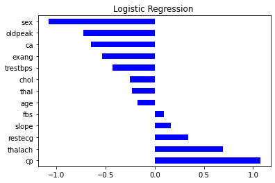

# Heart Disease Prediction

The following research and coding was done by **[Ankit Kapoor](https://github.com/ankitkapooor)**, **[Tauqir Waqar Panvelkar](https://github.com/tauqirwaqar)**, and **[Justin Sunil David](https://github.com/justinjsd)**

The project explores the idea of predicting heart disease based on a person’s medical data using various machine learning algorithms. The project compares multiple machine learning algorithms (**naïve bayes**, **K-nearest neighbors**, **XGBoost**, **decision trees**, **random forests**, and **linear regression**) and ranks them on the basis of their **accuracy**, the **f1 score** and area under the **ROC curve**. By assessing all these factors, we aim to conclude which algorithm among the ones selected is the best for prediction of heart diseases. The dataset used in the project is taken from the **[UC Irvine Machine Learning Repository](https://archive.ics.uci.edu/ml/datasets/heart+disease)**.

The code is written in **python** purely and makes use of certain packages important for machine learning. The packages used for the project:
* **pandas**
* **numpy**
* **matplotlib**
* **seaborn**
* **sklearn**
* **scipy**

The entire code is stored in the file titles **datamining.ipynb**. This file includes all steps, right from data-preprocessing until the final prediction and comparison.

~~~python
# normal patients
fig = plt.figure(figsize=(15,5))
ax1 = plt.subplot2grid((1,2),(0,0))
sns.distplot(normal['age'])
plt.title('Age Distribution of Normal Patients ', weight='bold')

ax1 = plt.subplot2grid((1,2),(0,1))
sns.countplot(normal['sex'], palette='viridis')
plt.title('Gender Distribution of Normal Patients', weight='bold' )
plt.show()

#heart patients
fig = plt.figure(figsize=(15,5))
ax1 = plt.subplot2grid((1,2),(0,0))
sns.distplot(disease['age'])
plt.title('Age Distribution of Heart Disease Patients',weight='bold')

ax1 = plt.subplot2grid((1,2),(0,1))
sns.countplot(disease['sex'], palette='viridis')
plt.title('Gender Distribution of Heart Disease Patients',weight='bold' )
plt.show()
~~~
The initial part of the project includes the **analysis of data** and data preprocessing. This includes showing the relation between variables and understanding the composition of the data. For instance, the aforementioned section of code looks at the project dataset and gives us an age distribution and gender distribution of normal patients and patients who have a heart disease in the form of the graphs shown below:

 
 

 ~~~python
 # Splitting the dataset
 X = data.drop('target', axis = 1).values
 y = data['target'].values
 x_train, x_test, y_train, y_test = train_test_split(X,y,test_size = 0.2, random_state = 1)  
 print('------------Training Set------------------')
 print(x_train.shape)
 print(y_train.shape)

 print('------------Test Set------------------')
 print(x_test.shape)
 print(y_test.shape)

 # Standardization
 from sklearn.preprocessing import StandardScaler
 sc = StandardScaler()
 x_train = sc.fit_transform(x_train)
 x_test = sc.transform(x_test)
 ~~~
The aforementioned block of code splits the data into two sections: **training data** and **test data** in an 80:20 ratio. This data is then **standardized** for processing.

The code then makes use of the **sklearn** library to come up generate prediction models for all the discussed machine learning algorithms. Upon the creation of this model, the algorithm tests its correctness on the basis of the following parameters:
* **Accuracy**
* **Precision**
* **Sensitivity**
* **Sensitivity**
* **Specificity**
* **F1 Score**
* **ROC curve**

~~~python
# Logistic Regression
lr = LogisticRegression()
lr.fit(x_train, y_train)

y_pred_lr = lr.predict(x_test)

# Model Evaluation : LR
print('Evaluating Logistic Regression ')
CM=confusion_matrix(y_test,y_pred_lr)
sns.heatmap(CM, annot=True)

TN = CM[0][0]
FN = CM[1][0]
TP = CM[1][1]
FP = CM[0][1]
specificity = TN/(TN+FP)
acc= accuracy_score(y_test, y_pred_lr)
roc=roc_auc_score(y_test, y_pred_lr)
prec = precision_score(y_test, y_pred_lr)
rec = recall_score(y_test, y_pred_lr)
f1 = f1_score(y_test, y_pred_lr)

model_results =pd.DataFrame([['Logistic Regression',acc, prec,rec,specificity, f1,roc]], columns = ['Model', 'Accuracy','Precision', 'Sensitivity','Specificity', 'F1 Score','ROC'])

model_results
~~~

For instance, the aforementioned block of code generates a prediction model using the **logisic regression** algorithm, tests the above mentioned parameters on it and the tabulates the results.

Using the same library, similar results are calculated for:
* **K Nearest Neighbor**
* **XG Boost**
* **Decision Tree**
* **Random Forest**
* **Naive Bayes**

All the results are then tabulated into one single table for an easier comparison. Here are the tabulated results:

|       Model | Accuracy | Precision | Sensitivity | Specificity | F1 Score | ROC      |
|------------:|---------:|----------:|------------:|------------:|---------:|----------|
| Naive Bayes | 0.770492 |  0.757576 |    0.806452 |    0.733333 | 0.781250 | 0.769892 |
|          LR | 0.737705 |  0.714286 |    0.806452 |    0.666667 | 0.757576 | 0.736559 |
|         KNN | 0.803279 |  0.771429 |    0.870968 |    0.733333 | 0.818182 | 0.802151 |
|         XGB | 0.721311 |  0.705882 |    0.774194 |    0.666667 | 0.738462 | 0.720430 |
|          RF | 0.803279 |  0.756757 |    0.903226 |    0.700000 | 0.823529 | 0.801613 |
|          DT | 0.721311 |  0.750000 |    0.677419 |    0.766667 | 0.711864 | 0.722043 |
|          NB | 0.770492 |  0.757576 |    0.806452 |    0.733333 | 0.781250 | 0.769892 |

For the tabulation of **ROC**, the ROC curve had to be generated. By using the **matplotlib** library the following block of code generates the ROC curve:

~~~python
# Plotting ROC curve

def roc_auc_plot(y_true, y_proba, label=' ', l='-', lw=1.0):
    from sklearn.metrics import roc_curve, roc_auc_score
    fpr, tpr, _ = roc_curve(y_true, y_proba[:,1])
    ax.plot(fpr, tpr, linestyle=l, linewidth=lw,
            label="%s (area=%.3f)"%(label,roc_auc_score(y_true, y_proba[:,1])))

f, ax = plt.subplots(figsize=(10,8))

roc_auc_plot(y_test,lr.predict_proba(x_test),label='Logitic Regression',l='-')
roc_auc_plot(y_test,knn.predict_proba(x_test),label='K Nearest Neighbours',l='-')
roc_auc_plot(y_test,xgb.predict_proba(x_test),label='XGboost',l='-')
roc_auc_plot(y_test,dt.predict_proba(x_test),label='Decision Tree Classifier ',l='-')
roc_auc_plot(y_test,rf.predict_proba(x_test),label='Random Forest Classifier ',l='-')
roc_auc_plot(y_test,nb.predict_proba(x_test),label='Naive Bayes',l='-')

ax.plot([0,1], [0,1], color='k', linewidth=0.5, linestyle='--',
        )    
ax.legend(loc="lower right")    
ax.set_xlabel('False Positive Rate')
ax.set_ylabel('True Positive Rate')
ax.set_xlim([0, 1])
ax.set_ylim([0, 1])
ax.set_title('Receiver Operator Characteristic curves')#
sns.despine()
~~~

In the end, we also assess the **feature importance** for each input attribute used in the input. This helps in showcasing which factor has the maximum effect on the predictions generated by the models. For instance, the following block of code generates the feature importance of all the attributes for **Logistic Regression**:

~~~python
importance = lr.coef_[0]
#importance is a list so you can plot it.
feat_importances = pd.Series(importance,index=index)
feat_importances.nlargest(20).plot(kind='barh',colormap='winter',title = 'Logistic Regression ')
~~~

The following are the top five most important input features for all the algorithms used:

|     Feature Rank    |     LR         |     DT          |     RF         |     XGB      |
|---------------------|----------------|-----------------|----------------|--------------|
|     1               |     cp         |     cp          |     cp         |     cp       |
|     2               |     thalach    |     chol        |     thalach    |     ca       |
|     3               |     restecg    |     ca          |     ca         |     exang    |
|     4               |     slope      |     exang       |     oldpeak    |     thal     |
|     5               |     fbs        |     trestbps    |     age        |     sex      |

The project takes an important step in the area of research concerning heart disease prediction. Multiple research papers cover the topic of predicting hear disease using machine learning algorithms but there there’s never quite the clarity on which algorithm is the most preferred. This paper tackles that very question- through intense testing on each algorithm considering various measures (like accuracy, f1 score, and the ROC curve), the most preferred algorithm for such a computation is devised.
